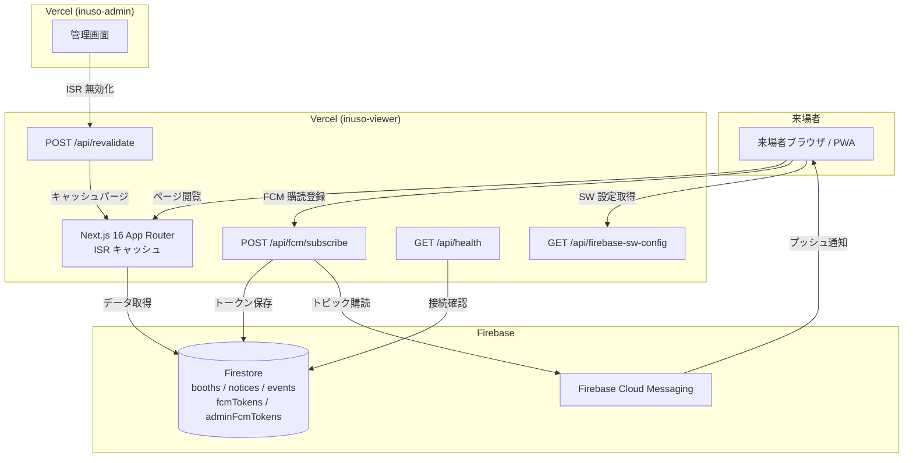
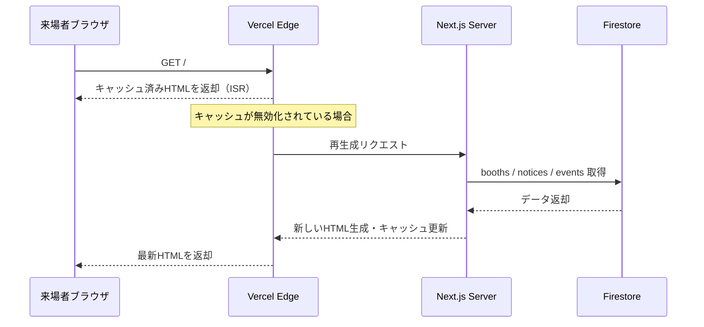
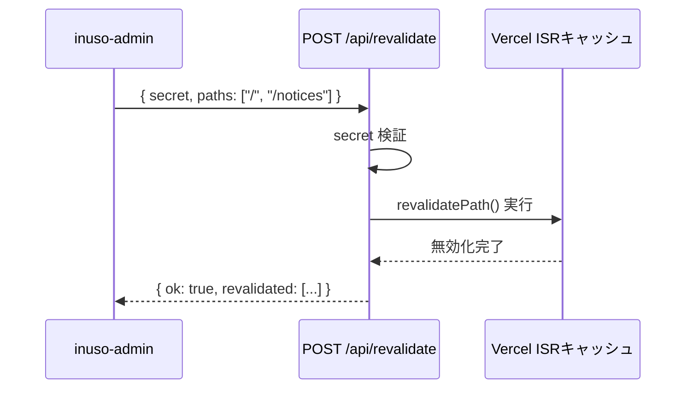
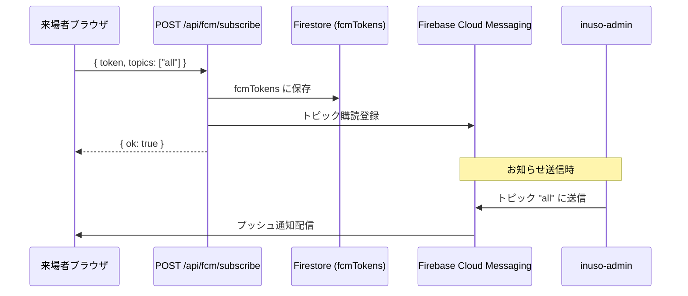

# システム構成・アーキテクチャ — inuso-viewer

## 概要

inuso-viewer は文化祭来場者向けの Next.js 16 App Router アプリです。ISR（Incremental Static Regeneration）でキャッシュしたページを配信し、inuso-admin からの `POST /api/revalidate` で即時更新します。

---

## システム構成図

---

## データフロー

### ページ閲覧フロー（ISR）

### ISR キャッシュ無効化フロー

### FCM プッシュ通知フロー（来場者向け）

---

## 主要コンポーネント

| レイヤー | 技術 | 役割 |
|---|---|---|
| フロントエンド | Next.js 16 App Router | ページレンダリング・PWA |
| ホスティング | Vercel | ISR・エッジ配信 |
| データベース | Firebase Firestore | ブース・お知らせ・イベントデータ |
| プッシュ通知 | Firebase Cloud Messaging (FCM) | 来場者へのプッシュ通知 |
| モニタリング | Google Analytics + Sentry | アクセス解析・エラー追跡 |
| ステータス | Instatus | サービス稼働状況ページ |
